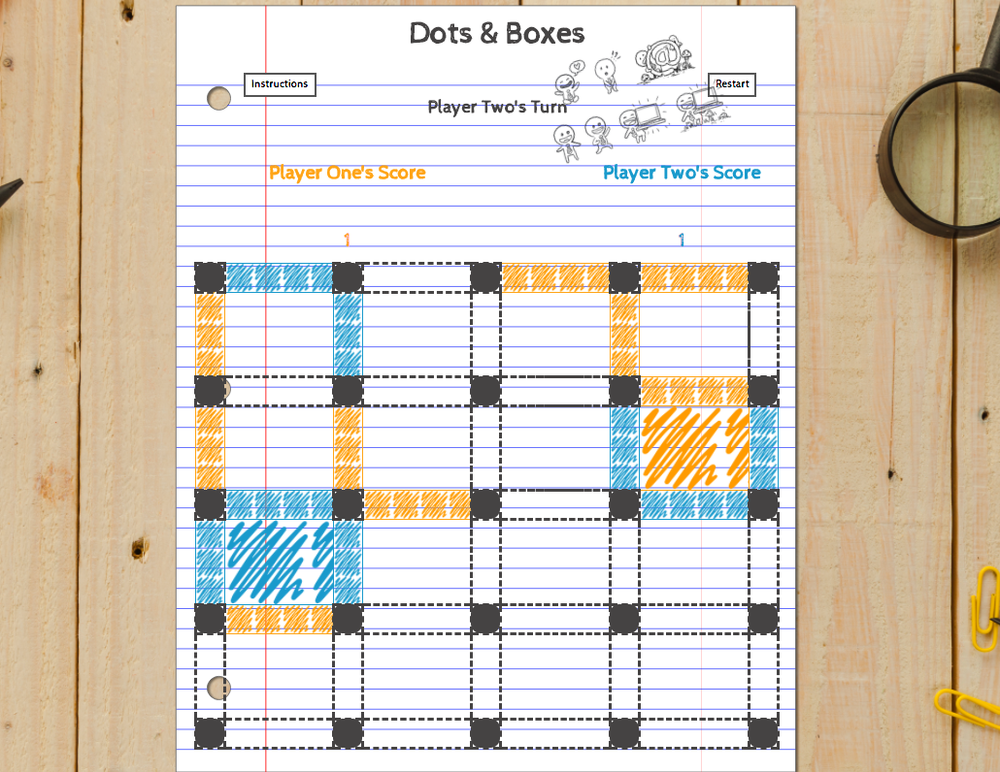

# Dots & Boxes
---
A take on a classic game played in school; the aim of the game is try to create more boxes than your opponent.

## How to Run

You can play this game locally or in browser.

To play this game in browser, click the link here: [Dots & Boxes](https://alisonao.github.io/Dots-and-Boxes/)

To play this game locally:

1. Clone or download this repository from `git@github.com:AlisonAO/project-1`.

2. Open `index.html` in the terminal to start the game.

 
## Instructions

 * This is a two player game. 
 * Take it in turns to click on a line to mark it with your colour.
 * Four filled lines are needed (regardless of their colour) to make up a box.
 * The person who clicks on the fourth line of the box will create it, and get another turn.
 * The more boxes you create the more turns you get.
 * The person with the most boxes created, once all the boxes are filled, will be the winner.
 
## Screenshots
 
 Below are some screenshots of the game:
 
 Instructions page:
 

Game screen:

 
 
## Languages
 
The languages used to make the game are HTML, CSS and JavaScript (with use of jQuery).

The game is HTML heavy, with the tables built up with a mixture of different sized divs.
The gameplay, sound and some effects are built in JavaScript, with use of jQuery. All of the styling has been done in CSS with some of the effects done in CSS also.

The game uses local storage to store the gameplay screen. When a user opens the game for the first time, it will take them to the instructions page. On the gamepay screen, once the user has clicked the restart button, they will be taken directly to the game screen instead of the instructions. 
If they wish to see the instructions again, click the instructions button on the top left of the screen.

 
## Future Modifications

 Possible features to add to the game:
 
  * Additional grid sizes: 3x3 and 5x5.
  * A single player mode, where you can play against a computer.
  * More animations.

